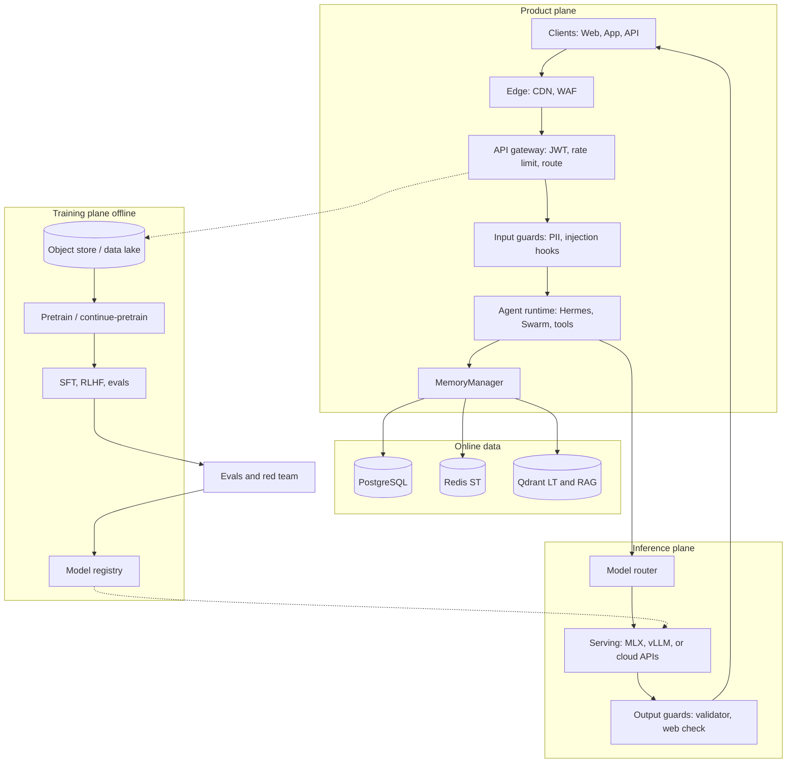
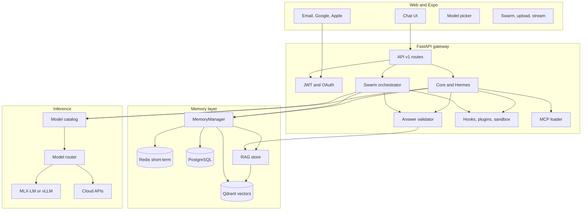
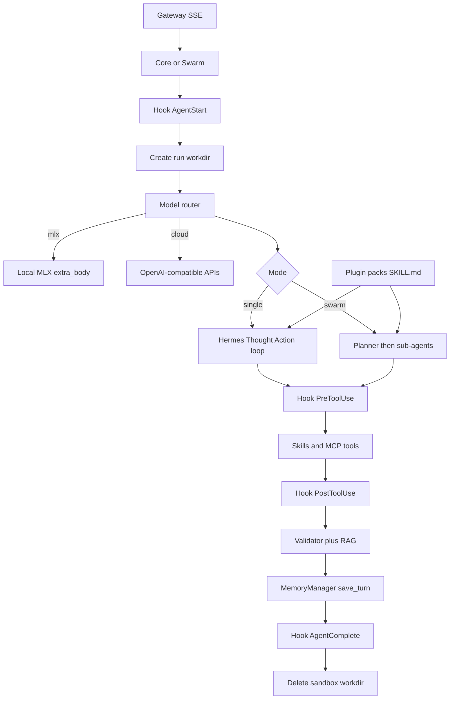
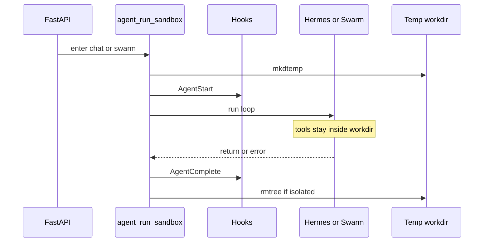
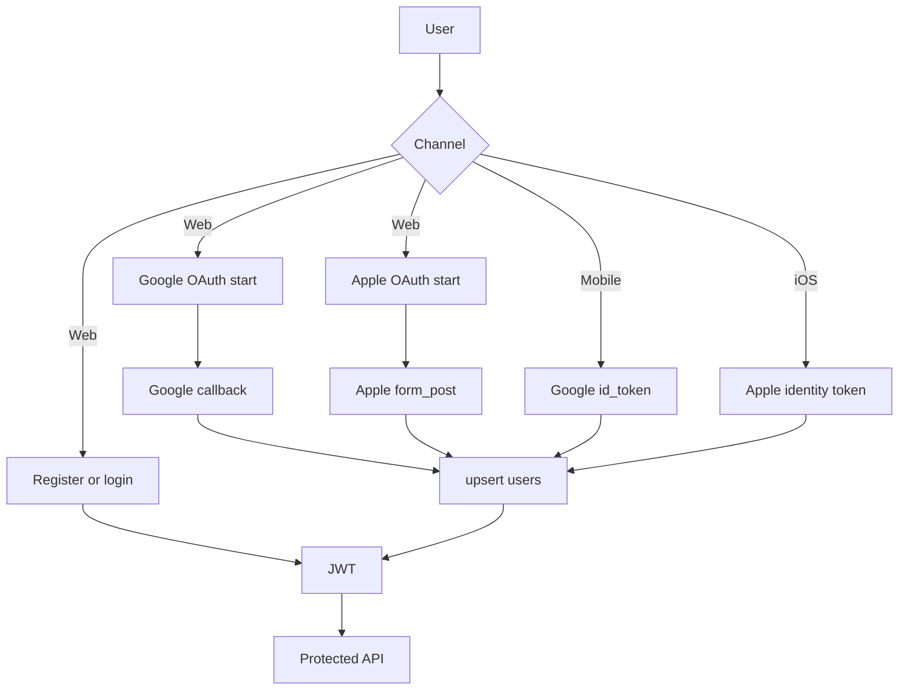
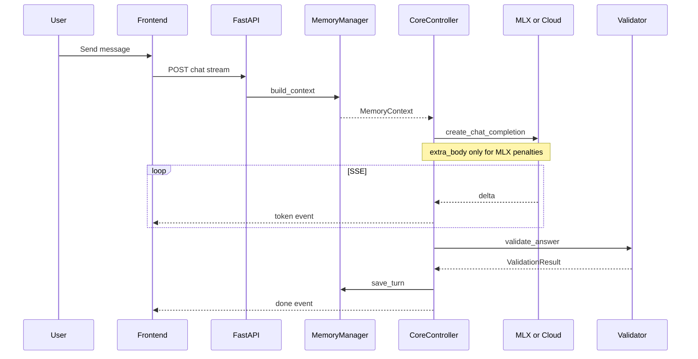
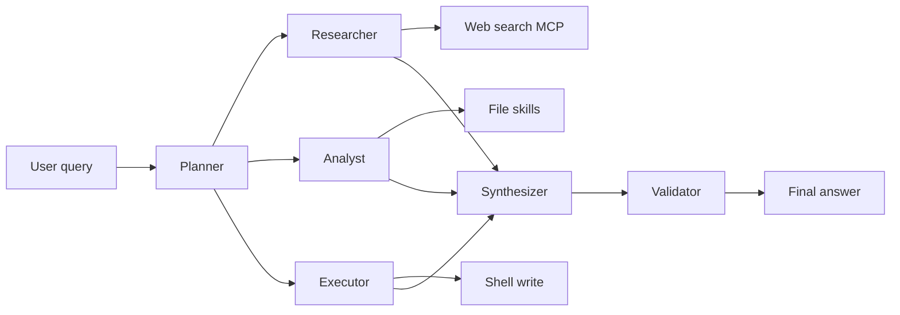
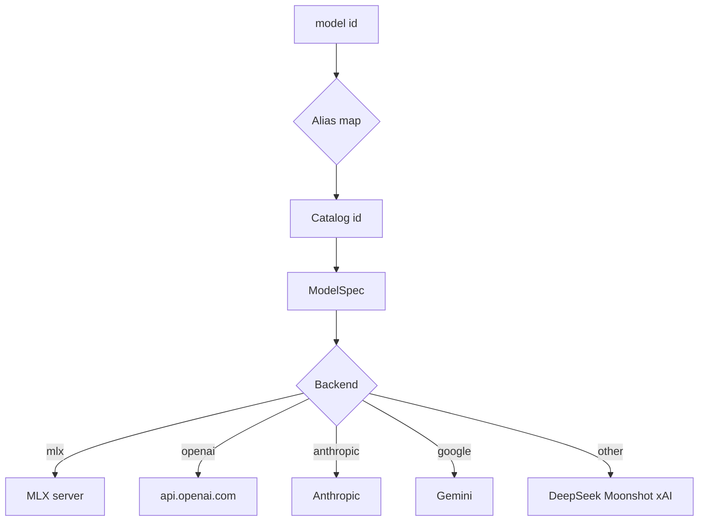
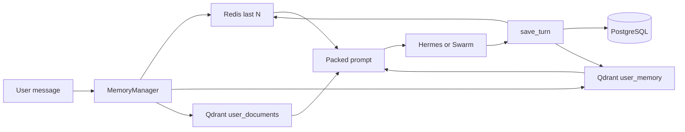
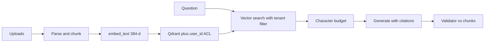

# LocalAI Agent — System Architecture

Enterprise-shaped **product / inference / training** planes on a codebase that today runs as Vite + Expo + FastAPI + MLX (or cloud APIs). Closed-lab internals (Claude, etc.) are not public; this maps those **design logics** onto this repo.

Memory packing, retrieval, and forgetting: **[docs/Memory.md](Memory.md)**.

---

## 1. Overview

- **Product plane:** accounts (email / Google / Apple), sessions, RAG uploads, agent UX, billing-ready JWT gateway.
- **Inference plane:** model registry + router, SSE, Hermes loop, Kimi-style swarm, sandbox/hooks/plugins, packed memory context.
- **Training plane (offline, target):** data lake of traces, SFT / RLHF / evals, model registry that **publishes into** the inference gateway — not in the request path.
- **Cross-cutting:** input/output guardrails (validator + hooks), OpenTelemetry-style traces (to add), tenant isolation on every Qdrant filter.

---

## 2. System diagrams (GitHub-safe Mermaid)

GitHub’s Mermaid parser rejects unquoted `*`, `+`, and some `/` in node text. Every label below is quoted.

### 2.1 Three planes (product, inference, training)



### 2.2 High-level components



### 2.3 Agent core — Hermes, Swarm, hooks, plugins, sandbox



### 2.4 Sandbox lifecycle



### 2.5 Auth



### 2.6 Chat plus validation



### 2.7 Swarm



### 2.8 Model routing (inference gateway)



Target serving (when leaving a single Mac): cache-aware scheduler → **prefill** nodes for long packed prompts → **decode** nodes for tokens → shared KV pool (Mooncake / vLLM PagedAttention). Local MLX is the current single-node stand-in.

### 2.9 Memory and RAG

Full write-up: [Memory.md](Memory.md).



### 2.10 RAG pipeline (product + retrieval)



---

## 3. Layer mapping (design logic → this repo)

| Plane | Design logic | This repo today | Scale-up |
|-------|----------------|-----------------|----------|
| Product | One gateway for identity, tenancy, uploads | FastAPI JWT, OAuth, sessions, RAG upload | Envoy/Kong, Redis rate limit, Stripe/metering |
| Auth | User + agent identity, short-lived creds | JWT, Google, Apple | OIDC (Keycloak), mTLS for tools, OPA |
| Memory | ST vs LT vs RAG, pack under window | Redis + PG + Qdrant, `_fit_context` | BM25 hybrid, reranker, session summaries |
| Inference | Throughput, TTFB, long-context KV | MLX or cloud `create_chat_completion` | vLLM/SGLang, prefill/decode split, FP8 |
| Tools | Least privilege + sandbox | Hooks, plugins, tempdir teardown | gVisor/Firecracker, approval queues |
| Guardrails | Input, tool, output | PreToolUse, validator, web check | Llama Guard, Presidio PII |
| Training | Offline, published models only | Not in request path | Lake + SFT/RLHF + evals → registry |
| Observe | Replay every request | Logs, memory overview | OpenTelemetry, Langfuse, eval gates |

Clipboard systems → code:

| Pattern | Source | Implementation |
|---------|--------|----------------|
| Observe / think / act | Hermes | `brain/hermes.py` |
| Planner swarm | Kimi | `agents/swarm.py` |
| Skills, hooks, plugins | Claude | `runtime/`, `plugins/` |
| Isolated exec | Codex / Cursor | `runtime/sandbox.py` `finally` |
| KV-centric serving | Mooncake | Target on inference plane, not MemoryManager |

---

## 4. Repetition token fix

| Layer | Location | Mechanism |
|-------|----------|-----------|
| 1 | `sanitize_completion_kwargs` | MLX `extra_body.repetition_penalty` only — never a `create()` kwarg |
| 2 | `normalize_stream_delta` | Cumulative vs delta streams |
| 3 | `should_stop_stream` | Stop after 8 identical deltas |
| 4 | `collapse_repetition` | Post-process final text |

---

## 5. Answer validation

`backend/app/agents/validator.py`: RAG cross-check, optional web search, JSON revise. Config `ANSWER_VALIDATION_ENABLED`, `VALIDATION_USE_WEB_SEARCH`.

---

## 6. Memory architecture

See **[docs/Memory.md](Memory.md)** for retrieval, packing, TTL, and forget APIs.

| Lane | Storage | API |
|------|---------|-----|
| ST | Redis | `st_memory` |
| Canonical + LT | PostgreSQL + Qdrant `user_memory` | `lt_memory` |
| RAG | PostgreSQL + Qdrant `user_documents` | `rag_store` |

```python
ctx = await memory_manager.build_context(user_id, session_id, query)
await memory_manager.save_turn(db, session_id, user_id, user_msg, assistant_msg)
```

---

## 7. Model catalog

`backend/app/llm/registry.py`. Catalog ids (example `mlx-llama-3.2-3b`) map to local MLX ids or cloud API ids.

---

## 8. API reference

| Method | Path | Description |
|--------|------|-------------|
| POST | `/api/v1/auth/register` | Email/username |
| POST | `/api/v1/auth/login` | Username or email |
| GET | `/api/v1/auth/providers` | `{ email, google, apple }` |
| GET | `/api/v1/auth/oauth/google/start` | Browser Google |
| GET | `/api/v1/auth/oauth/apple/start` | Browser Apple |
| POST | `/api/v1/auth/oauth/google` | Native Google token |
| POST | `/api/v1/auth/oauth/apple` | Native Apple token |
| GET | `/api/v1/models` | Catalog |
| POST | `/api/v1/sessions` | Chat session |
| DELETE | `/api/v1/sessions/{id}` | Forget ST + LT for session |
| POST | `/api/v1/chat` | Sync chat |
| POST | `/api/v1/chat/stream` | SSE |
| POST | `/api/v1/uploads` | Upload + RAG index |
| GET | `/api/v1/rag/documents` | List uploads |
| DELETE | `/api/v1/rag/documents/{id}` | Forget one document |
| GET | `/api/v1/memory/overview` | Store snapshot |
| GET | `/api/v1/runtime/plugins` | Plugins |
| GET | `/health` | Health |

---

## 9. Mobile

`mobile/` Expo. `eas build` / `eas submit`. `EXPO_PUBLIC_API_URL` must be public HTTPS. Google/Apple client ids must match backend.

---

## 10. Infrastructure (dev)

| Service | Port | Purpose |
|---------|------|---------|
| Frontend | 3000 | Vite |
| Backend | 8080 | FastAPI |
| MLX-LM | 8000 | Local generate |
| PostgreSQL | 5432 | Canonical data |
| Redis | 6379 | ST + Celery |
| Qdrant | 6333 | LT + RAG |

```bash
./scripts/start_llm_mlx.sh
./scripts/start_dev.sh
```

---

## 11. Directory structure

```
localAIAgent/
├── backend/app/
│   ├── agents/
│   ├── auth/
│   ├── brain/
│   ├── llm/
│   ├── memory/          # see docs/Memory.md
│   ├── runtime/
│   ├── skills/
│   └── api/routes.py
├── frontend/src/
├── mobile/
├── plugins/
├── docs/ARCHITECTURE.md
├── docs/Memory.md
├── AGENTS.md
└── SKILLS.md
```

---

## 12. Troubleshooting

| Symptom | Cause | Fix |
|---------|-------|-----|
| GitHub Mermaid lexical error | Unquoted `*` in `/api/v1/*` | Quoted labels only (this file) |
| `repetition_penalty` TypeError | OpenAI SDK kwargs | `create_chat_completion` |
| Backend import SyntaxError | `global` after use | `embeddings.py` global at function top |
| Auth proxy ECONNREFUSED | API not running | Restart `start_dev.sh` |
| RAG empty | No upload / Qdrant down | Attach file; check overview |
| Context overflow / ramble | Budget too high | Lower `MEMORY_CONTEXT_CHAR_BUDGET` |

---

## 13. Security

- JWT on API except auth + health
- Uploads under `uploads/{user_id}/`
- Qdrant filters always include `user_id`
- PreToolUse hooks; sandbox deleted on AgentComplete
- Do not commit `.env`
