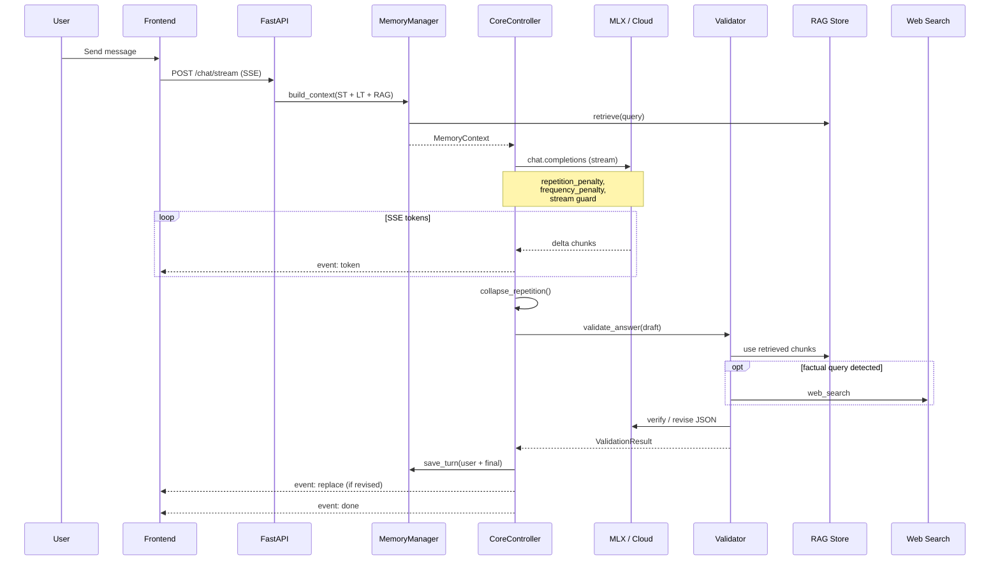
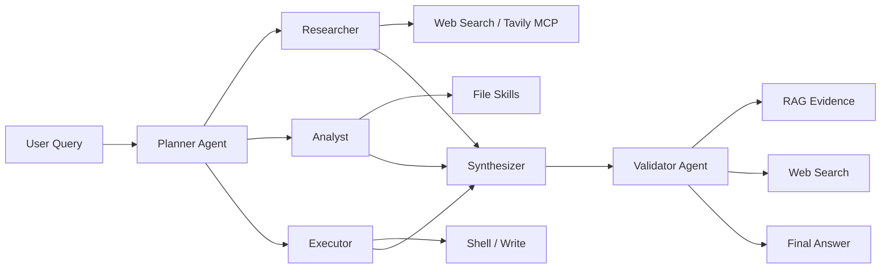
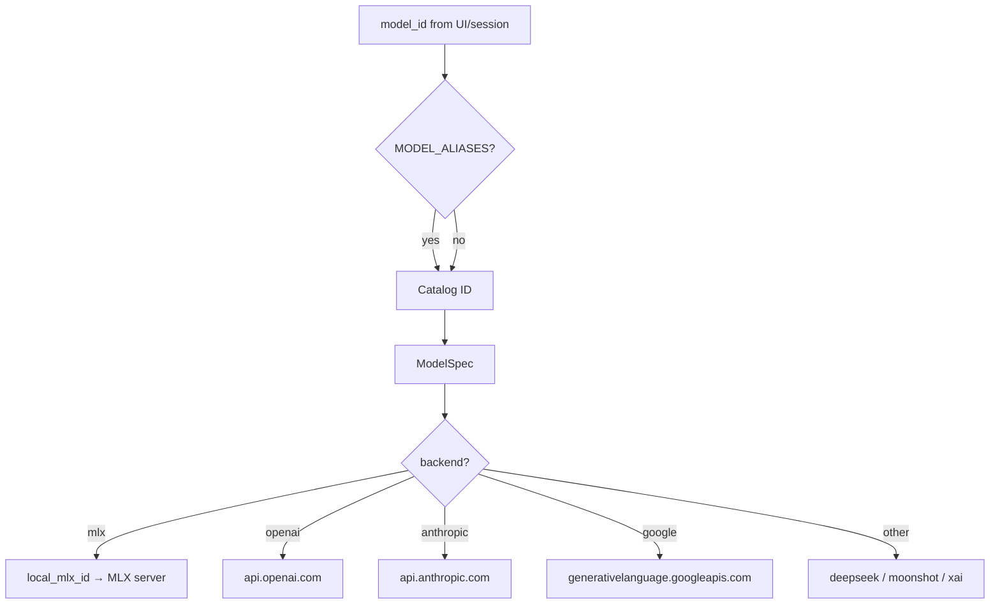

# LocalAI Agent — System Architecture & Technical Reference

## 1. Overview

LocalAI Agent is a multi-agent AI platform for **Apple Silicon (MLX)** and optional **cloud LLM APIs**. It combines:

- **Chain-of-Thought (CoT)** reasoning with tool calling
- **Multi-agent swarm** orchestration (planner → sub-agents → synthesizer)
- **Answer validation** against RAG documents and web search
- **Three-layer memory**: short-term (Redis), long-term (PostgreSQL + Qdrant), RAG (documents)
- **MCP integration** (Tavily, Slack, Notion, etc.)
- **SSE streaming** chat with repetition guards

---

## 2. System Architecture (Mermaid)

### 2.1 High-Level Component Diagram

```mermaid
flowchart TB
    subgraph Client["Frontend (React :3000)"]
        UI[Chat UI]
        ModelPicker[Model Picker]
        FeatureBar[Swarm / Upload / Stream]
    end

    subgraph API["Backend API (FastAPI :8080)"]
        Routes[/api/v1/*]
        Auth[JWT Auth]
        Brain[Core Controller]
        Swarm[Swarm Orchestrator]
        Validator[Answer Validator]
        MCP[MCP Loader]
    end

    subgraph Memory["Memory Layer"]
        ST[(Redis — ST Memory)]
        PG[(PostgreSQL — Messages/Docs)]
        Qdrant[(Qdrant — Vectors)]
        RAG[RAG Store]
        MM[Memory Manager]
    end

    subgraph LLM["Inference"]
        Registry[Model Registry]
        Router[Model Router]
        MLX[MLX-LM Server :8000]
        Cloud[Cloud APIs<br/>OpenAI/Anthropic/Google/...]
    end

    subgraph External["External Services"]
        Tavily[Tavily Web Search]
        MCPServers[MCP Servers]
        Celery[Celery Workers]
    end

    UI --> Routes
    Routes --> Auth
    Routes --> Brain
    Routes --> Swarm
    Brain --> MM
    Swarm --> MM
    MM --> ST
    MM --> PG
    MM --> RAG
    RAG --> Qdrant
    MM --> Qdrant

    Brain --> Registry
    Swarm --> Registry
    Registry --> Router
    Router --> MLX
    Router --> Cloud

    Brain --> Validator
    Swarm --> Validator
    Validator --> RAG
    Validator --> Tavily

    Brain --> MCP
    MCP --> MCPServers
    Brain --> Tavily

    Routes --> Celery
```

### 2.2 Chat Request Flow (Single Agent + Validation)



### 2.3 Swarm Orchestration Flow



### 2.4 Model Routing



---

## 3. Repetition Token Fix (Technical Detail)

Small MLX models (e.g. Llama 3.2 3B) can enter **degenerate repetition loops** during streaming. This system applies **four layers of protection**:

| Layer | Location | Mechanism |
|-------|----------|-----------|
| 1. Generation params | `_completion_kwargs()` | `repetition_penalty=1.15`, `frequency_penalty=0.3`, `presence_penalty=0.2` |
| 2. Delta normalization | `repetition.normalize_stream_delta()` | Handles servers that send cumulative text instead of deltas |
| 3. Stream circuit breaker | `should_stop_stream()` | Stops after 8 identical consecutive deltas |
| 4. Post-processing | `collapse_repetition()` | Removes repeated phrases/lines from completed text |

**Config (`.env`):**

```env
LLM_REPETITION_PENALTY=1.15
LLM_REPETITION_CONTEXT_SIZE=40
LLM_FREQUENCY_PENALTY=0.3
LLM_PRESENCE_PENALTY=0.2
LLM_MAX_TOKENS=2048
```

**SSE events during stream issues:**

| Event | Meaning |
|-------|---------|
| `warning` | Stream stopped due to repetition loop |
| `validating` | Validator cross-checking answer |
| `validation` | Issues found (includes sources used) |
| `replace` | Final validated/revised content |

---

## 4. Answer Validation Orchestration

The **Validator Agent** (`backend/app/agents/validator.py`) runs after draft generation:

1. **RAG cross-check** — compares draft against retrieved document chunks
2. **Web search** — triggered when query/answer contains factual/time-sensitive patterns (years, "latest", "price", etc.)
3. **LLM revision** — returns JSON `{ valid, issues, revised_answer }`
4. **Fallback** — if validation fails technically, original draft is kept with optional caution note

```env
ANSWER_VALIDATION_ENABLED=true
VALIDATION_USE_WEB_SEARCH=true
```

Validation metadata is returned in:

- `POST /api/v1/chat` → `validation` field
- SSE `event: done` → `data.validation`
- Swarm results include `validation` + `agents_used: ["validator", ...]`

---

## 5. Memory Architecture

| Layer | Storage | TTL / Scope | API |
|-------|---------|-------------|-----|
| Short-term | Redis | Last N messages per session | `st_memory` |
| Long-term | PostgreSQL + Qdrant | All messages, semantic recall | `lt_memory` |
| RAG | PostgreSQL (metadata) + Qdrant (chunks) | User uploads | `rag_store` |

**Unified entry point:** `MemoryManager` (`backend/app/memory/manager.py`)

```python
ctx = await memory_manager.build_context(user_id, session_id, query)
# ctx.st_history, ctx.lt_memories, ctx.rag_chunks

await memory_manager.save_turn(db, session_id, user_id, user_msg, assistant_msg)
```

---

## 6. Model Catalog

11 models in `backend/app/llm/registry.py`:

| ID | Backend | Notes |
|----|---------|-------|
| `mlx-llama-3.2-3b` | MLX | Default for MacBook Air M2 |
| `mlx-llama-3.1-8b` | MLX | Higher quality, 16GB+ RAM |
| `mlx-gemma-2-9b` | MLX | Google Gemma 2 |
| `mlx-qwen-7b` | MLX | Multilingual |
| `mlx-deepseek-r1` | MLX | Reasoning |
| `openai-gpt-4o` | Cloud | Requires `OPENAI_API_KEY` |
| `anthropic-claude` | Cloud | Requires `ANTHROPIC_API_KEY` |
| `google-gemini-flash` | Cloud | Requires `GOOGLE_API_KEY` |
| `deepseek-chat` | Cloud | Requires `DEEPSEEK_API_KEY` |
| `moonshot-kimi` | Cloud | Requires `MOONSHOT_API_KEY` |
| `xai-grok` | Cloud | Requires `XAI_API_KEY` |

Legacy IDs (`meta-llama/*`, `mlx-community/*`) auto-map via `MODEL_ALIASES`.

---

## 7. API Reference (Core Endpoints)

| Method | Path | Description |
|--------|------|-------------|
| POST | `/api/v1/auth/register` | Create user |
| POST | `/api/v1/auth/login` | JWT token |
| GET | `/api/v1/models` | Model catalog with availability |
| POST | `/api/v1/sessions` | Create chat session |
| POST | `/api/v1/chat` | Sync chat (+ swarm, validation) |
| POST | `/api/v1/chat/stream` | SSE streaming chat |
| POST | `/api/v1/chat/async` | Celery background chat |
| POST | `/api/v1/uploads` | Upload + auto RAG index |
| GET | `/api/v1/rag/documents` | List indexed documents |
| GET | `/api/v1/mcp/status` | Registered MCP tools |
| GET | `/health` | Backend health |

### Chat Request Body

```json
{
  "session_id": "uuid",
  "message": "Your question",
  "model_name": "mlx-llama-3.2-3b",
  "use_swarm": false,
  "attachments": ["uploads/user-id/doc.txt"]
}
```

### SSE Event Types

```
event: start
event: token
event: tool_start
event: tool_result
event: thinking
event: warning
event: validating
event: validation
event: replace
event: done
event: error
```

---

## 8. Infrastructure & Ports

| Service | Port | Purpose |
|---------|------|---------|
| Frontend | 3000 | React dev server |
| Backend | 8080 | FastAPI |
| MLX-LM | 8000 | Local inference |
| PostgreSQL | 5432 | Persistent storage |
| Redis | 6379 | ST memory + Celery broker |
| Qdrant | 6333 | Vector search |

**Start commands:**

```bash
./scripts/start_llm_mlx.sh    # Terminal 1
./scripts/start_dev.sh        # Terminal 2 (Docker + backend + frontend)
```

---

## 9. Directory Structure

```
localAIAgent/
├── backend/app/
│   ├── agents/          # swarm.py, validator.py
│   ├── brain/           # controller.py, repetition.py
│   ├── llm/             # registry.py, router.py
│   ├── memory/          # manager.py, rag.py, short_term.py, long_term.py
│   ├── mcp/             # client.py, loader.py
│   ├── skills/          # builtin tools + web_search
│   └── api/routes.py
├── frontend/src/        # React UI
├── scripts/             # start_dev.sh, start_llm_mlx.sh
├── docs/ARCHITECTURE.md # This file
├── AGENTS.md
└── SKILLS.md
```

---

## 10. Troubleshooting

| Symptom | Cause | Fix |
|---------|-------|-----|
| Same token repeating forever | MLX repetition loop | Fixed via penalties + stream guard; restart backend |
| Chat hangs | MLX not running | `./scripts/start_llm_mlx.sh` |
| Model 401/404 | Gated HF model id | Use catalog id `mlx-llama-3.2-3b` |
| No tool calling on MLX | mlx-lm limitation | Use Swarm mode or cloud model with `LLM_ENABLE_TOOLS=true` |
| RAG empty | No uploads / Qdrant down | Upload via Attach button; check Qdrant |
| Validation slow | Extra LLM + web call | Set `ANSWER_VALIDATION_ENABLED=false` for speed |

---

## 11. Security Notes

- JWT auth on all `/api/v1/*` routes (except auth register/login)
- User uploads scoped to `uploads/{user_id}/`
- Do not commit `.env` with real API keys
- MCP URLs may contain secrets — use env vars only
