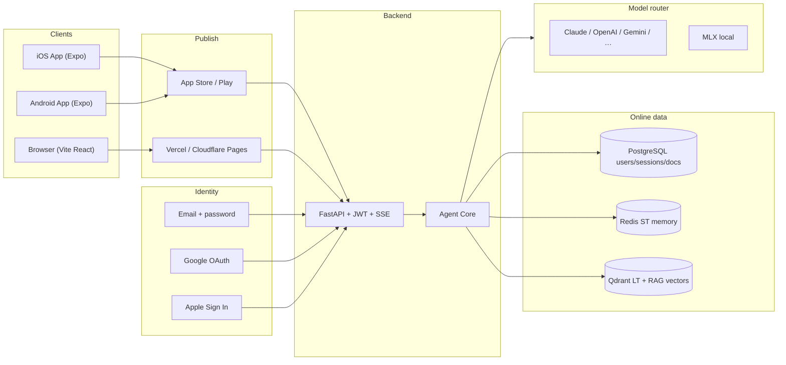
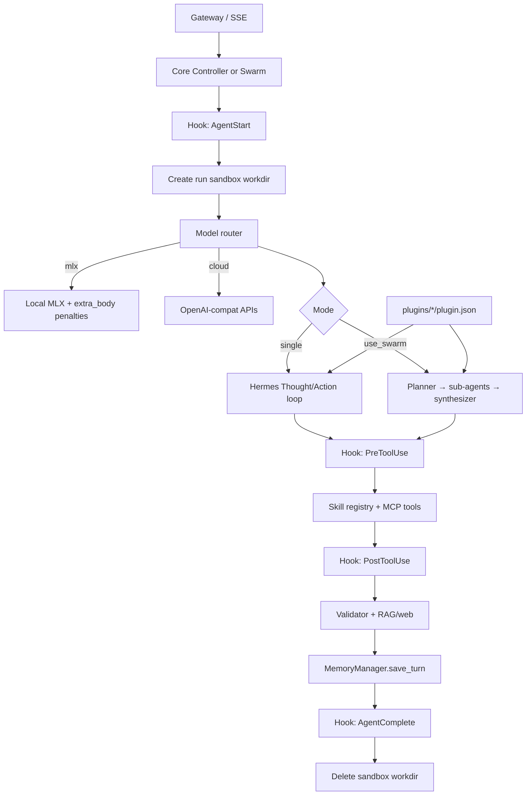
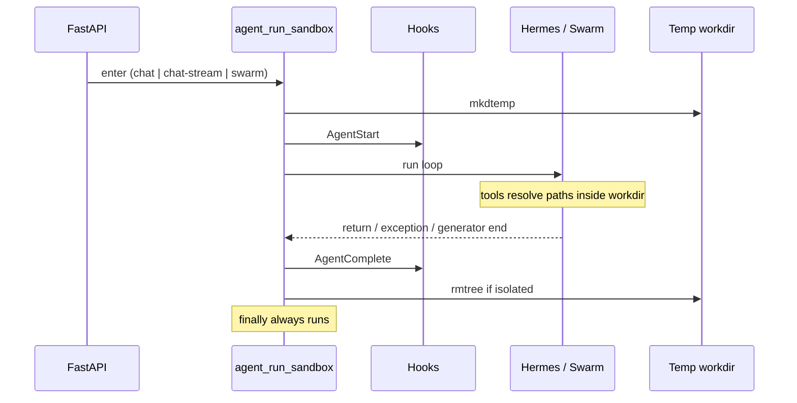
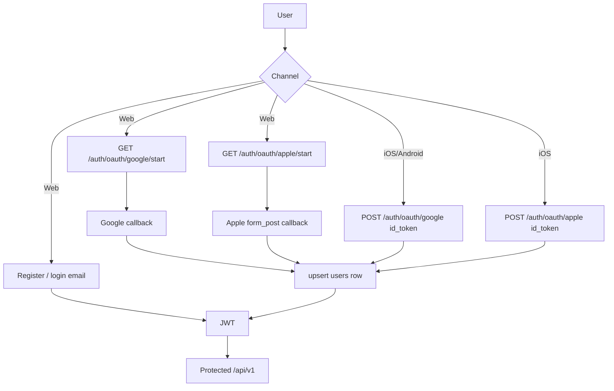
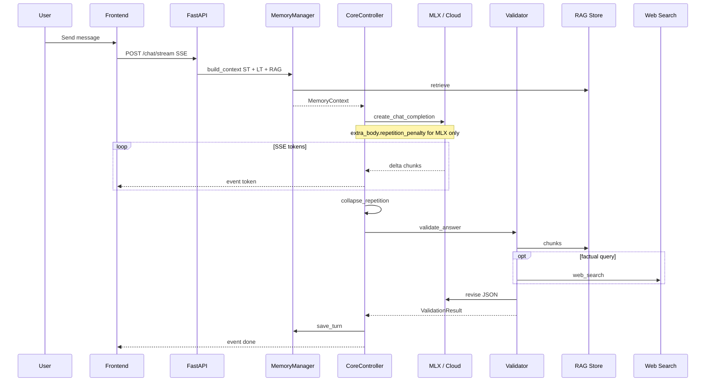
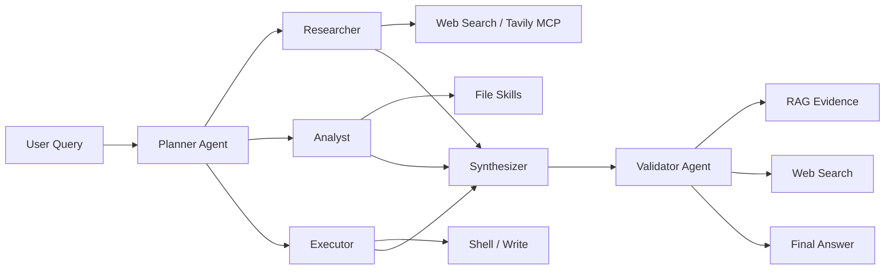
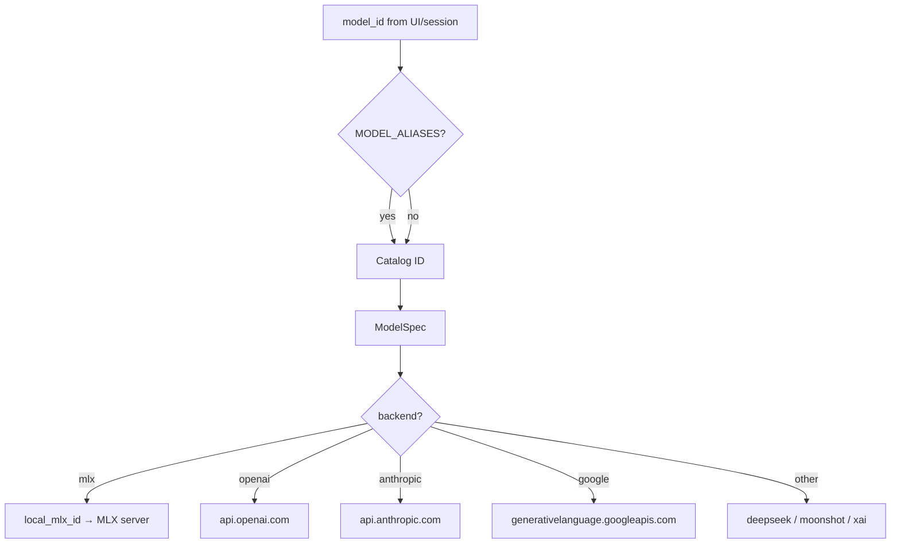
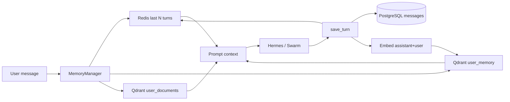

# LocalAI Agent — System Architecture & Technical Reference

## 1. Overview

LocalAI Agent is a multi-client, multi-agent platform: **Vite web**, **Expo iOS/Android**, and a **FastAPI** gateway. It combines:

- **Hermes** observe → think → act loop (works without native tool-calling)
- **Kimi-style swarm** (planner → researcher/analyst/executor → synthesizer)
- **Claude-style** skills, hooks, plugins, and per-run sandbox
- **Online auth**: email register/login, Google, Apple (web + native)
- **Memory**: Redis short-term, PostgreSQL + Qdrant long-term, RAG documents
- **Model routing**: MLX local, plus OpenAI / Anthropic / Google / DeepSeek / Moonshot / xAI
- **SSE streaming** with repetition guards (`repetition_penalty` only via `extra_body`)

---

## 2. System Architecture (Mermaid)

### 2.1 Deployment topology (web + mobile stores)



### 2.2 High-level components

```mermaid
flowchart TB
    subgraph Client["Web :3000 · Expo mobile"]
        UI[Chat UI]
        AuthUI[Email / Google / Apple]
        ModelPicker[Model Picker]
        FeatureBar[Swarm / Upload / Stream]
    end

    subgraph API["Backend API (FastAPI :8080)"]
        Routes[/api/v1/*]
        Auth[JWT + OAuth]
        Brain[Core + Hermes]
        Swarm[Swarm Orchestrator]
        Validator[Answer Validator]
        Runtime[Hooks / Plugins / Sandbox]
        MCP[MCP Loader]
    end

    subgraph Memory["Memory Layer"]
        ST[(Redis — ST Memory)]
        PG[(PostgreSQL — Users/Messages/Docs)]
        Qdrant[(Qdrant — Vectors)]
        RAG[RAG Store]
        MM[Memory Manager]
    end

    subgraph LLM["Inference"]
        Registry[Model Registry]
        Router[Model Router]
        MLX[MLX-LM Server :8000]
        Cloud[Cloud APIs]
    end

    AuthUI --> Auth
    UI --> Routes
    Routes --> Auth
    Routes --> Brain
    Routes --> Swarm
    Brain --> Runtime
    Swarm --> Runtime
    Brain --> MM
    Swarm --> MM
    MM --> ST
    MM --> PG
    MM --> RAG
    RAG --> Qdrant
    MM --> Qdrant
    Brain --> Registry
    Swarm --> Registry
    Registry --> Router
    Router --> MLX
    Router --> Cloud
    Brain --> Validator
    Swarm --> Validator
    Validator --> RAG
    Brain --> MCP
```

### 2.3 Agent Core — Hermes · Swarm · Hooks · Plugins · Sandbox



### 2.4 Sandbox lifecycle (always ends when the agent finishes)



### 2.5 Auth (online accounts)



### 2.6 Chat request flow (single agent + validation)



### 2.7 Swarm orchestration



### 2.8 Model routing



### 2.9 Memory and RAG



---

## 3. Design mapping (clipboard systems → this repo)

| Pattern | Source | Implementation |
|---------|--------|----------------|
| Observe / think / act | Hermes | `brain/hermes.py` + controller loop |
| Planner + specialist swarm | Kimi | `agents/swarm.py` |
| Skills + hooks + plugins | Claude | `skills/`, `runtime/hooks.py`, `runtime/plugins.py`, `plugins/` |
| Risk-isolated execution | Codex / Cursor | `runtime/sandbox.py` torn down in `finally` |
| IDE-style file tools | Cursor | sandboxed `read_file` / `write_file` / shell whitelist |

---

## 4. Repetition token fix

Small MLX models can loop identical tokens. Four layers:

| Layer | Location | Mechanism |
|-------|----------|-----------|
| 1. Generation params | `sanitize_completion_kwargs()` | MLX: `extra_body.repetition_penalty` (never a `create()` kwarg). OpenAI-compat: `frequency_penalty` / `presence_penalty` |
| 2. Delta normalization | `repetition.normalize_stream_delta()` | Cumulative vs delta streams |
| 3. Stream circuit breaker | `should_stop_stream()` | Stops after 8 identical consecutive deltas |
| 4. Post-processing | `collapse_repetition()` | Strip repeated phrases from final text |

```env
LLM_REPETITION_PENALTY=1.15
LLM_REPETITION_CONTEXT_SIZE=40
LLM_FREQUENCY_PENALTY=0.3
LLM_PRESENCE_PENALTY=0.2
LLM_MAX_TOKENS=2048
```

If you pass `repetition_penalty=` into `AsyncCompletions.create()`, the OpenAI Python SDK raises `unexpected keyword argument`. All completions must go through `create_chat_completion()`.

---

## 5. Answer validation

`backend/app/agents/validator.py` after draft generation:

1. Cross-check against RAG chunks
2. Optional web search for time-sensitive claims
3. LLM JSON `{ valid, issues, revised_answer }`
4. Keep draft on technical failure

```env
ANSWER_VALIDATION_ENABLED=true
VALIDATION_USE_WEB_SEARCH=true
```

---

## 6. Memory architecture

| Layer | Storage | Scope | API |
|-------|---------|-------|-----|
| Short-term | Redis | Last N messages per session | `st_memory` |
| Long-term | PostgreSQL + Qdrant | Persistent messages + semantic recall | `lt_memory` |
| RAG | PostgreSQL metadata + Qdrant chunks | User uploads | `rag_store` |

```python
ctx = await memory_manager.build_context(user_id, session_id, query)
await memory_manager.save_turn(db, session_id, user_id, user_msg, assistant_msg)
```

---

## 7. Model catalog

See `backend/app/llm/registry.py`. Catalog ids such as `mlx-llama-3.2-3b` map to local MLX ids or cloud API ids. Legacy Hugging Face ids map via `MODEL_ALIASES`.

---

## 8. API reference

| Method | Path | Description |
|--------|------|-------------|
| POST | `/api/v1/auth/register` | Email/username account |
| POST | `/api/v1/auth/login` | Username **or** email + password |
| GET | `/api/v1/auth/providers` | `{ email, google, apple }` |
| GET | `/api/v1/auth/oauth/google/start` | Browser Google redirect |
| GET | `/api/v1/auth/oauth/apple/start` | Browser Apple redirect |
| POST | `/api/v1/auth/oauth/google` | Native Google ID token |
| POST | `/api/v1/auth/oauth/apple` | Native Apple identity token |
| GET | `/api/v1/models` | Catalog |
| POST | `/api/v1/sessions` | Chat session |
| POST | `/api/v1/chat` | Sync chat (+ swarm) |
| POST | `/api/v1/chat/stream` | SSE |
| POST | `/api/v1/uploads` | Upload + RAG index |
| GET | `/api/v1/runtime/plugins` | Loaded plugins |
| GET | `/health` | Health |

Chat body:

```json
{
  "session_id": "uuid",
  "message": "Your question",
  "model_name": "mlx-llama-3.2-3b",
  "use_swarm": false,
  "attachments": ["uploads/user-id/doc.txt"]
}
```

---

## 9. Mobile publish

`mobile/` is an Expo app sharing the same JWT API.

```bash
cd mobile
npx eas build --platform ios --profile production
npx eas build --platform android --profile production
npx eas submit --platform ios
npx eas submit --platform android
```

Set `EXPO_PUBLIC_API_URL` to the public HTTPS API. Google web client id must match backend `GOOGLE_OAUTH_CLIENT_ID`. Apple Services ID / bundle id must match `APPLE_OAUTH_CLIENT_ID`. Web Apple also needs `APPLE_OAUTH_TEAM_ID`, `APPLE_OAUTH_KEY_ID`, `APPLE_OAUTH_PRIVATE_KEY`.

---

## 10. Infrastructure

| Service | Port | Purpose |
|---------|------|---------|
| Frontend | 3000 | Vite React |
| Backend | 8080 | FastAPI |
| MLX-LM | 8000 | Local inference |
| PostgreSQL | 5432 | Users, sessions, messages, documents |
| Redis | 6379 | ST memory + Celery |
| Qdrant | 6333 | LT + RAG vectors |

```bash
./scripts/start_llm_mlx.sh
./scripts/start_dev.sh
```

---

## 11. Directory structure

```
localAIAgent/
├── backend/app/
│   ├── agents/          # swarm, validator
│   ├── auth/            # jwt, oauth
│   ├── brain/           # controller, hermes, repetition
│   ├── llm/             # registry, router
│   ├── memory/          # manager, rag, short_term, long_term
│   ├── runtime/         # hooks, plugins, sandbox
│   ├── skills/
│   └── api/routes.py
├── frontend/src/        # React web
├── mobile/              # Expo iOS/Android
├── plugins/             # Claude-style plugin packs
├── docs/ARCHITECTURE.md
├── AGENTS.md
└── SKILLS.md
```

---

## 12. Troubleshooting

| Symptom | Cause | Fix |
|---------|-------|-----|
| `unexpected keyword argument 'repetition_penalty'` | OpenAI SDK | Use `create_chat_completion`; restart backend |
| Same token repeating | MLX loop | Penalties in extra_body + stream guard |
| Chat hangs | MLX down | `./scripts/start_llm_mlx.sh` |
| No tool calling on MLX | mlx-lm | Hermes protocol or swarm; or cloud + `LLM_ENABLE_TOOLS=true` |
| RAG empty | No uploads / Qdrant | Attach files; check Qdrant |
| Google/Apple login missing | Empty env | Set OAuth client ids (and Apple key for web) |

---

## 13. Security notes

- JWT on `/api/v1/*` except auth + health
- Uploads scoped to `uploads/{user_id}/`
- Skills run PreToolUse hooks; file tools stay in sandbox
- Sandbox directory is deleted when the agent run ends
- Do not commit `.env` secrets
