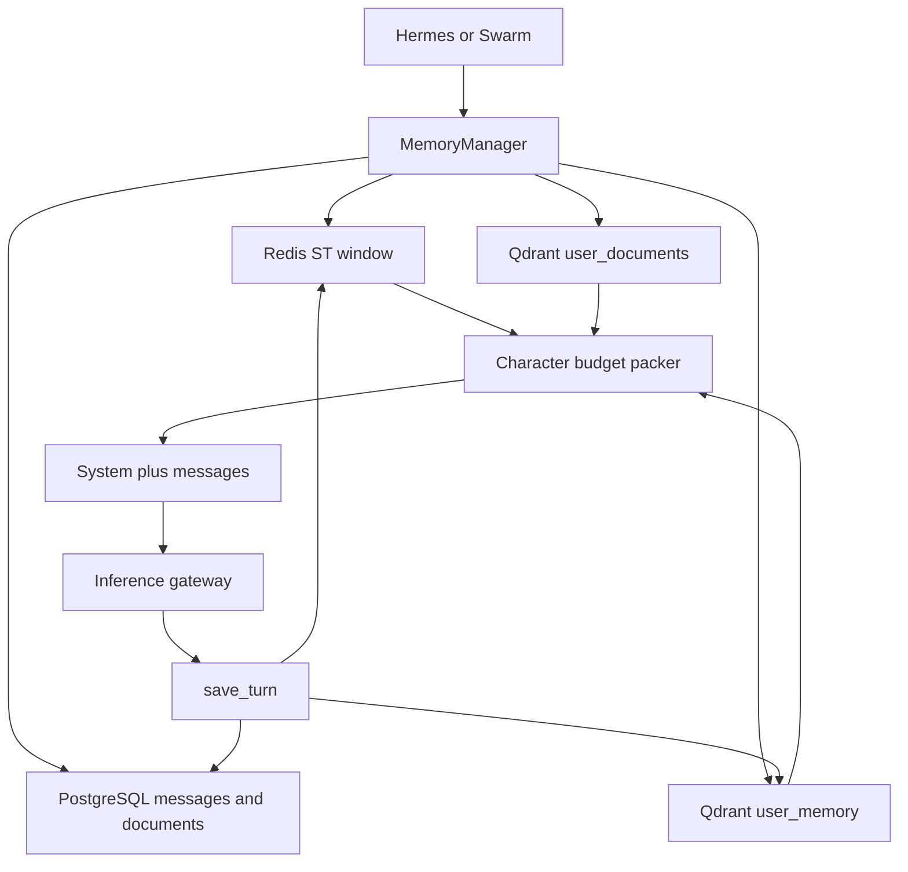
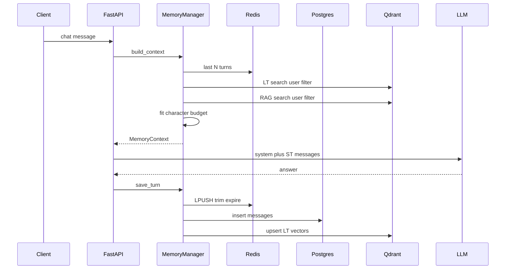

# Memory Layer

Short-term (Redis), long-term (PostgreSQL + Qdrant), and RAG (uploaded documents) share one facade: `MemoryManager` in `backend/app/memory/manager.py`. Agents never talk to Redis or Qdrant directly. They call `build_context` before inference and `save_turn` after a run. Forgetting is explicit (`forget_session`, `DELETE` document) plus TTL on the hot window.

This document is the source of truth for retrieval, packing, context-window overflow, interop between stores, and deletion. Architecture diagrams live in `docs/ARCHITECTURE.md`.

---

## 1. Why three stores

| Lane | Store | Latency | Lifetime | What it is |
|------|--------|---------|----------|------------|
| Short-term (ST) | Redis list `session:{id}:history` | Sub-ms | Rolling N messages + TTL | Immediate dialogue window |
| Canonical history | PostgreSQL `messages` | Low | Until session/user delete | Source of truth, listing, replay |
| Long-term semantic (LT) | Qdrant `user_memory` | ms | Until forget | Embeddings of past turns, **user-scoped** |
| RAG | PostgreSQL `documents` + Qdrant `user_documents` | ms | Until document delete | Chunked uploads, **user-scoped** |

PostgreSQL is not a vector store. Qdrant is not the chat transcript. Redis is not durable across Redis flush. Each write path keeps those roles separate so a failed embedding does not lose the message row (`embedding_status=failed`).



---

## 2. Interop: one context object

`MemoryContext` is the only structure the controller and swarm consume:

```python
ctx = await memory_manager.build_context(user_id, session_id, query)
# ctx.st_history     -> chat.completions messages
# ctx.lt_memories    -> system section "Relevant Long-Term Memory"
# ctx.rag_chunks     -> system section "Relevant Documents (RAG)"
```

`to_system_sections()` serializes LT as JSON and RAG as numbered citations `[1] (filename, score=…)`. The agent loop then:

1. Puts ST history into the **messages** array (roles preserved).
2. Injects LT + RAG into the **system** prompt (not as extra user turns).
3. After the answer, `save_turn` dual-writes ST and LT so the next request can retrieve this turn semantically.

Swarm uses the same `build_context` before planning, so researcher/analyst/executor see the same memory snapshot as single-agent chat. Validator reuses `ctx.rag_chunks` instead of searching again.

User isolation is a **filter at retrieve time**, not a prompt instruction:

- Qdrant `must: user_id = current user`
- PostgreSQL `WHERE user_id = …`
- Redis keys are per `session_id`; sessions already belong to a user

There is no cross-user vector search.

---

## 3. Short-term memory (working window)

**File:** `backend/app/memory/short_term.py`

- Key: `session:{session_id}:history`
- Write: `LPUSH` JSON `{role, content}` then `LTRIM 0 .. N-1` (`ST_MEMORY_MAX_MESSAGES`, default 20)
- Read: `LRANGE` then reverse so oldest is first
- Forget: `EXPIRE` (`ST_MEMORY_TTL_SECONDS`, default 86400) and `DELETE` on session delete

This is **session-local**. Switching chats does not leak ST into another session. It **does** forget idle sessions when TTL hits, even if PostgreSQL still has the full transcript. Reloading a session from the sidebar uses PostgreSQL `get_session_messages`, not Redis.

Why Redis instead of stuffing PostgreSQL into every prompt: the hot path is every token-generating request; Redis avoids a SQL round-trip for the last 20 turns.

---

## 4. Long-term memory (semantic recall)

**File:** `backend/app/memory/long_term.py`

On `save_message`:

1. Insert `messages` row (`embedding_status=pending`).
2. Embed with `embed_text` (384-d cosine; see embeddings below).
3. Upsert Qdrant point id = `message.id`, payload `{message_id, session_id, user_id, role, content[:4000]}`.
4. Set `embedding_status` to `indexed` or `failed`.

On `retrieve(user_id, query)`:

1. Embed the **current user question** (not the whole history).
2. HNSW search in `user_memory`, filter `user_id`.
3. Return top `LT_MEMORY_RETRIEVAL_LIMIT` (default 5) with scores.

LT is **cross-session**. A fact said last week can surface in a new chat if the query embedding is close. That is intentional: ST is “what we just said”; LT is “what this user has said that is relevant now.”

Forget:

- `forget_session(session_id)` deletes Qdrant points with that `session_id`.
- Session HTTP `DELETE` also `st_memory.clear` and cascades PostgreSQL messages.
- `forget_user` deletes all LT points for a tenant (account deletion path).

---

## 5. RAG (document lane)

**Files:** `rag.py`, `extract.py`

Ingest:

1. Extract text (PDF via pypdf, DOCX via document.xml, otherwise UTF-8).
2. Chunk ~600 characters with 80 overlap (`chunk_text`).
3. Insert `documents` row (filename, path, `chunk_count`).
4. Embed each chunk; upsert `user_documents` with payload `{document_id, user_id, filename, chunk_index, content}`.

Retrieve:

1. Embed the query.
2. Search with `user_id` filter, `RAG_RETRIEVAL_LIMIT` (default 5).
3. Citations keep `filename` + `score` for the validator and the UI.

Forget:

- `DELETE /api/v1/rag/documents/{document_id}` removes PG row **and** all Qdrant chunks for that `document_id` (still filtered by `user_id`).
- `forget_user` drops every RAG point for that user.

ACL is the `user_id` payload filter. Enterprise next step (not in code yet): add `workspace_id` / group tags and filter them in the same `must` clause **before** the LLM sees chunks — never “retrieve then hope the model ignores other tenants.”

---

## 6. Embeddings (shared 384-d space)

**File:** `backend/app/memory/embeddings.py`

Qdrant collections are fixed at **384 dimensions**. The encoder tries the configured embedding API (`EMBEDDING_BASE_URL` / OpenAI). If the API is down or returns another width, it falls back to a **lexical hash** (`lexical_embedding`) so indexing never writes 48-byte SHA blobs into a 384-d collection.

LT and RAG **must** use the same function. Mixing models would make cosine scores meaningless across collections (they are already separate collections, but the query vector still has to match ingest).

---

## 7. Exceeding the context window

Small MLX models (8k or less) cannot take “all Redis + all LT + all RAG.” `MemoryManager._fit_context` is the packer:

| Knob | Default | Role |
|------|---------|------|
| `ST_HISTORY_MAX_CHARS` | 4000 | Cap ST; walk **newest first**, drop oldest turns |
| `RAG_CHUNK_MAX_CHARS` | 500 | Truncate each LT/RAG snippet |
| `MEMORY_CONTEXT_CHAR_BUDGET` | 8000 | Cap **system** LT+RAG text; drop extra chunks (prefer dropping RAG when counts tie) |
| `LLM_MAX_TOKENS` | 2048 | Generation budget, not prompt budget |
| `ST_MEMORY_MAX_MESSAGES` | 20 | Redis hard cap before packing |

Priority when overflowing:

1. Keep the latest ST turns (conversation coherence).
2. Keep highest-ranked LT/RAG already returned by Qdrant (search already sorted by score; packer pops from the **end** of those lists).
3. Never silently concatenate unbounded files into the prompt.

This is **character** budgeting, not tokenizer-accurate. For production SLO, map `memory_context_char_budget` to `model.context_k * 0.4` so prompt + tools + `max_tokens` stay under the model window.

Further tactics (not all coded):

- Summarize ST into a rolling “session brief” when `len(history) == N` instead of only dropping.
- Query rewrite before retrieve (hyDE / multi-query) to raise hit quality so fewer chunks are needed.
- Hybrid BM25 + vector (OpenSearch or Qdrant payload full-text) so exact IDs and error codes are not lost to embedding.
- Prefill/decode split and prefix cache on the **inference** side (Mooncake-style) so a stable system prompt is not re-prefilled every turn.

---

## 8. Forgetting policy

| Event | ST Redis | PostgreSQL | Qdrant LT | Qdrant RAG |
|-------|----------|------------|-----------|------------|
| New message beyond N | `LTRIM` oldest | Keep | Keep | — |
| Idle session | Key expires (TTL) | Keep | Keep | — |
| Delete session | `DEL` key | Cascade messages | `forget_session` | Unchanged |
| Delete document | — | Delete `documents` row | — | Delete points by `document_id` |
| Delete account (call `forget_user`) | Sessions gone | Cascade | All user points | All user points |

Failed embeddings leave PG rows (`failed`) so operators can reindex; they do not pollute the vector store.

There is **no** automatic decay on Qdrant scores yet (no time-to-live on points). Enterprise extension: payload `created_at` + retrieve-time boost, or a nightly job that drops points older than policy.

---

## 9. Request lifecycle



---

## 10. Code map

| Concern | Path |
|---------|------|
| Facade, packing | `backend/app/memory/manager.py` |
| Redis ST | `short_term.py` |
| PG + Qdrant LT | `long_term.py` |
| RAG ingest/retrieve/delete | `rag.py` |
| File text | `extract.py` |
| 384-d embed + lexical fallback | `embeddings.py` |
| Collection dim check | `qdrant_util.py` |
| Operator snapshot | `inspect.py`, `GET /api/v1/memory/overview` |
| Delete session | `DELETE /api/v1/sessions/{id}` |
| Delete RAG doc | `DELETE /api/v1/rag/documents/{id}` |

---

## 11. Config

```env
ST_MEMORY_MAX_MESSAGES=20
ST_MEMORY_TTL_SECONDS=86400
LT_MEMORY_RETRIEVAL_LIMIT=5
RAG_ENABLED=true
RAG_RETRIEVAL_LIMIT=5
MEMORY_CONTEXT_CHAR_BUDGET=8000
ST_HISTORY_MAX_CHARS=4000
RAG_CHUNK_MAX_CHARS=500
QDRANT_COLLECTION=user_memory
QDRANT_RAG_COLLECTION=user_documents
EMBEDDING_BASE_URL=http://localhost:8000/v1
EMBEDDING_MODEL=text-embedding-3-small
```

---

## 12. Product vs inference vs training (memory’s place)

- **Product layer** owns tenants, sessions, uploads, forget APIs, and the Memory UI overview. It never embeds inside the browser.
- **Inference layer** only receives a **packed** prompt. KV-cache / prefill-decode (Kimi Mooncake, vLLM PagedAttention) sit **after** packing; they do not replace ST/LT/RAG.
- **Training layer** (offline) should ingest **redacted** traces from PostgreSQL + tool logs into a data lake for SFT/RLHF. Live Redis is not a training corpus. Do not train on another customer’s RAG chunks.

See the three-plane diagram in `docs/ARCHITECTURE.md`.
